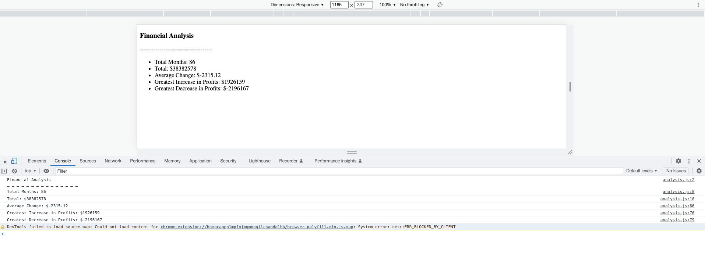

# Ugo's Console Finances
### A simple financial analysis tool to test out my Javascript skills

## Table of Contents

- [Overview](#overview)
- [Usage](#usage)
- [Built With](#built-with)
- [Contact](#contact)
- [Acknowledgements](#acknowledgements)

## Overview

The goal was to try and apply my newly learned Javascript skills (Iterating over arrays and writing basic for loops) in developing a simple financial analysis tool for use in a real-world situation. Hence, I wrote some code to analyze the financial records of a company using a financial dataset (received in form of an array) that shows the companies profit and loss numbers on a month by month basis for about 84 months.

  

## Usage

Simply replace the file index.js with the dataset to be analysed. Please ensure the array within that file follows the same format as the existing dataset.

## Built With

- Basic HTML
- Very litte CSS
- Beginner-level Javascript: Variables, methods, For Loops, Functions, Manipulating HTML DOM

See acknowledgments at bottom of page or click [here](#acknowledgements) 

## Contact

- Email: ugnwokoro@yahoo.com
- Twitter: https://twitter.com/ugopreneur
- LinkedIn: https://www.linkedin.com/in/ugonwokoro/ 
- Dev.to: https://dev.to/ugopreneur 

## Acknowledgements

A few sources i must give credit for helping me build this:

- The usual tips and resources from W3Schools, Mozilla.org and Stack Overflow
- Assistance from my brilliant tutor Wongani "Jay" Jere